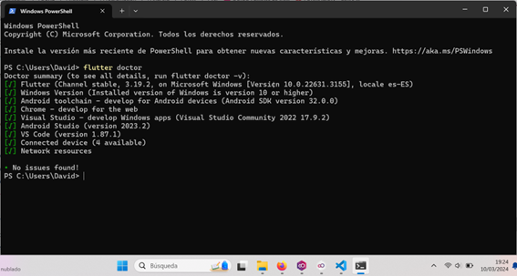
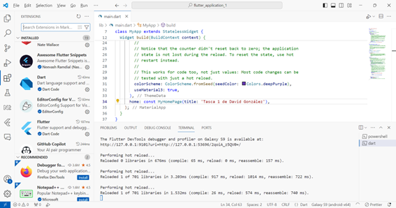
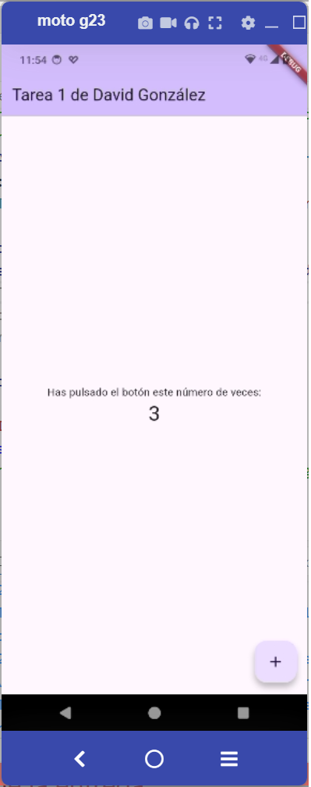

   

# Práctica 1. Instalación de  Flutter

En esta unidad hemos tratado las herramientas necesarias para el desarrollo multiplataforma con Flutter, y hemos visto cómo generar un proyecto de ejemplo.

La labor de esta unidad consistirá pues en realizar la instalación de las herramientas necesarias en vuestro equipo, antes de que comencemos con el desarrollo en sí.

Concretamente, habrá que realizar la instalación y configuración de:

1. El framework **Flutter**.
   
2. El editor de código **Visual Studio Code**, junto con las **extensiones** necesarias para el desarrollo con Flutter,
3.	**Opcional**: La herramienta de emulación **Genymotion**.

Para la evaluación de la tarea se entregarán tres capturas de pantalla con el siguiente contenido:

1. Una captura de pantalla con la salida del orden `flutter doctor` que muestre una configuración correcta del framework.
   
2.	Una captura de pantalla de la herramienta **VSCode**, mostrando las **extensiones** para el desarrollo con Flutter,

3.	Una captura de pantalla del emulador o de la ejecución del programa en un dispositivo Android, que muestre la aplicación de ejemplo del contador, **modificando el texto de la cabecera** 'Flutter Demo Home Page' por un texto con vuestro nombre, por ejemplo 'Tarea 1 de Jose A. Murcia'.

Consideraciones

1. Si ya disponéis de Android Studio y queréis hacer uso del emulador del mismo, podéis hacerlo, y enviar la captura de pantalla del mismo en lugar de la de Genymotion.
   
2. En caso de que vuestro equipo no disponga de los recursos suficientes para la instalación del emulador, o deseáis hacer los proyectos para web o escritorio, podéis hacer la última captura con Google Chrome o la salida de la aplicación en versión escritorio.

El resultado puede ser algo así:

`flutter doctor`:

**Extensiones:**

**Ejecución:**

Esta práctica no será necesario entregarla.

